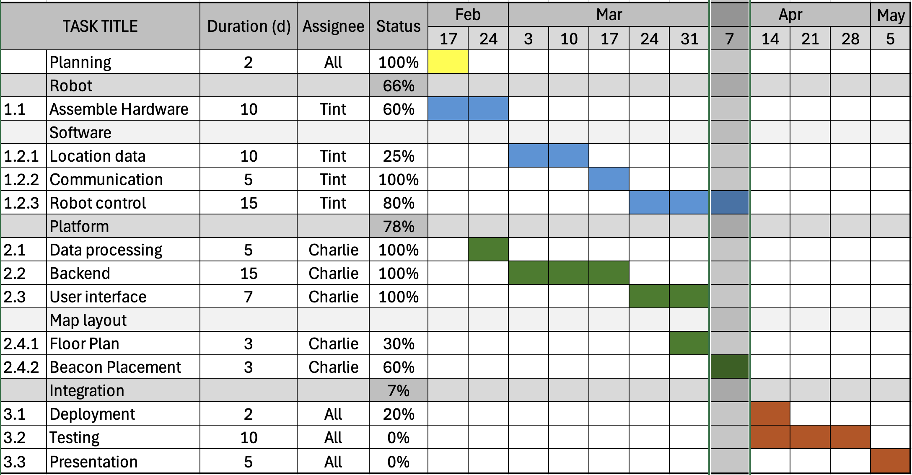
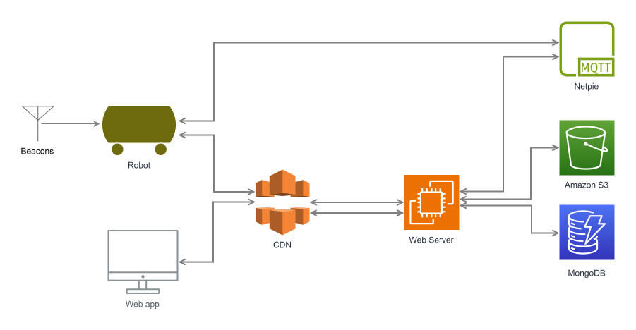

# Robomotion

Robomotion is a robot monitoring and control solution designed for indoor
environments. The system utilizes beacons signal strength to identify the robot
position.

## Table of Contents

-   [Features](#features)
-   [Timeline](#timeline)
-   [System](#system)
-   [Installation](#installation)
-   [Usage](#usage)

## Features

1. Location estimation using RSSI
2. Control the movements via web application

## Timeline

## System

A visual representation of the project's architecture.

## Weekly update

#### Week 1 (Feb 17)

1. Project planning
2. Define initial system requirements
3. Install the development environment and set up version control
4. Identify piece of hardware needed for the project

#### Week 2 (Feb 24)

1. Finalize system design
2. Create initial mockups for web
3. Setup NETPIE broker and design MQTT message format
4. Design pin mapping for robot

#### Week 3 (Mar 3)

1. Research on RSSI-based location estimation
2. Start working on backend (web server)
3. Develop robot movement control sketch

#### Week 4 (Mar 10)

1. Developed a prototype for the location estimation using RSSI
2. Connect to NETPIE from backend and ESP32
3. Host static files on the server
4. Design backend API needed

#### Week 5 (Mar 17)

1. Provision and setup EC2 instance for web server
2. Install backend module on the server
3. Develop compass module for robot

#### Week 6 (Mar 24)

1. Test and debug backend module
2. Start working on speed control
3. Adjust web interface

#### Week 7 (Mar 31)

1. Test and debug backend module
2. Test and debug frontend module
3. Adjust MQTT message format
4. Testing Ultrasonic Sensor (HC-SR04) for obstacle detection
5. Testing location estimation with RSSI value with ESP32

#### Week 8 (Apr 7)

1. Deploy webserver and database on AWS
2. Start working on ESP32 - Mega2560 communication
3. Adjust user interface
4. ESP32 trilateration testing

#### Week 9 (Apr 14)

1. Test robot movement with user control

#### Week 10 (Apr 21)

1. View location logs from database in history page
2. Support multiple robots on web UI
3. Test 4 ultrasonic sensors (60001)

#### Week 11 (Apr 28)

1. Set up testing environment
2. Test controlling the robot via web UI

#### Week 12 (May 05)

1. Set up testing environment
2. Test controlling the robot via web UI

## Usage

1. Setup the robot. See [Robot Installation](robot/readme.md).

2. Setup the server in `/server`. See [Server Installation](server/readme.md).
